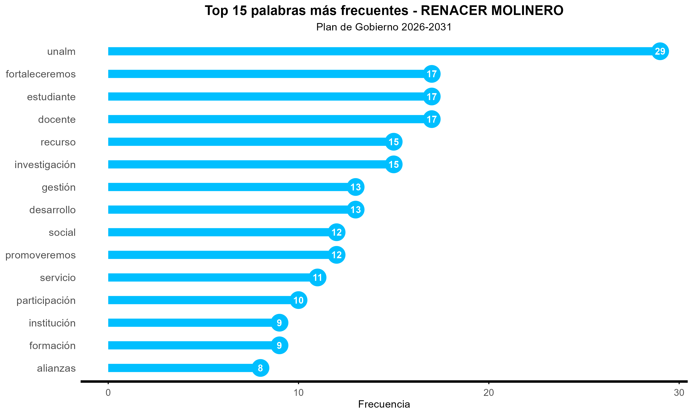
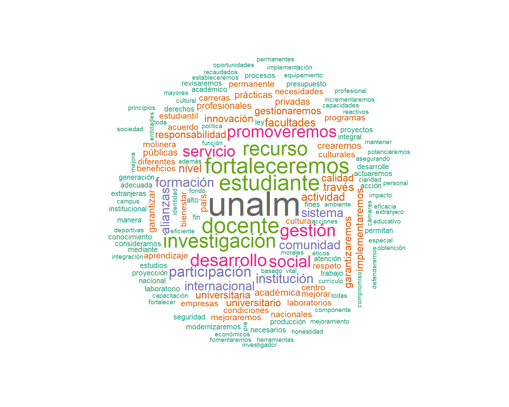
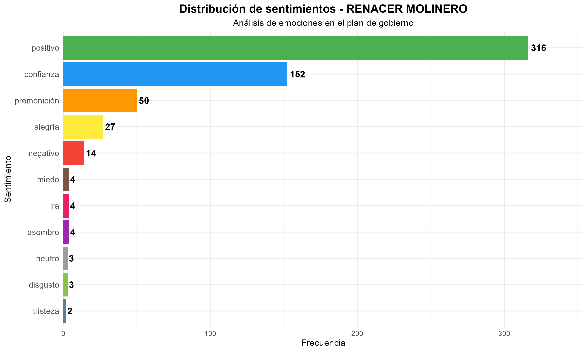
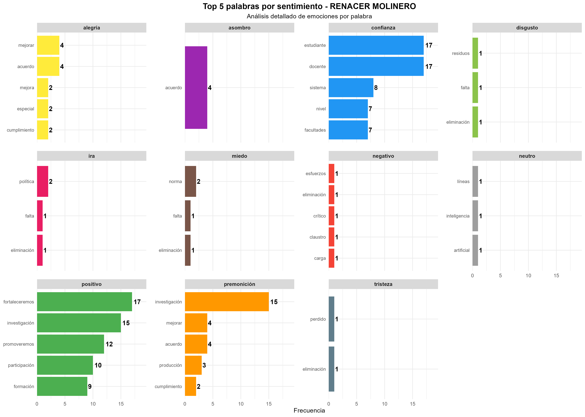
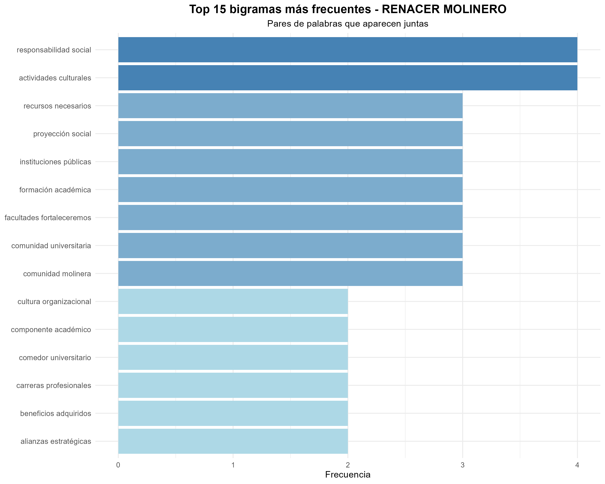
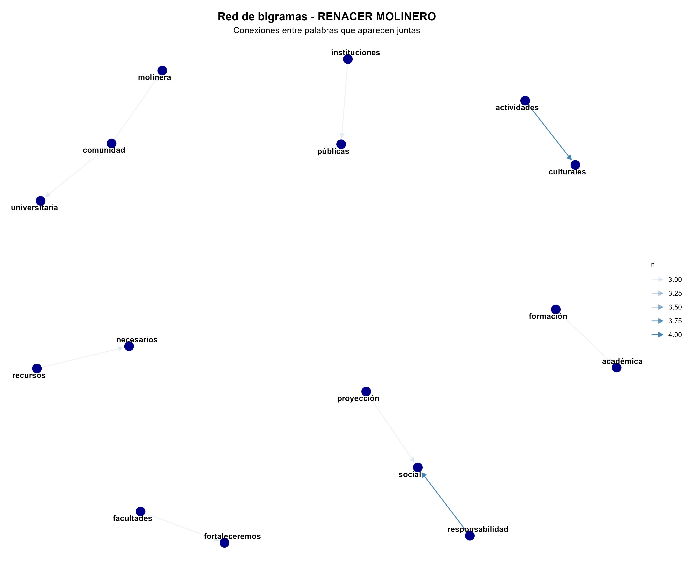
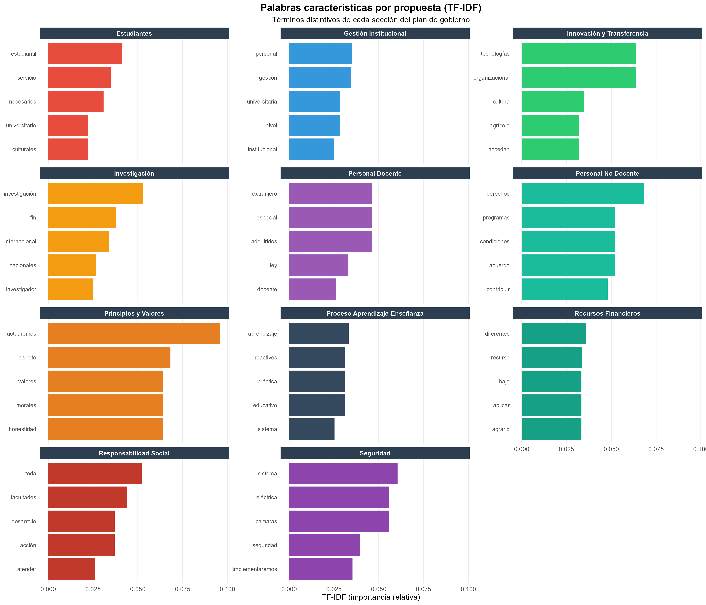
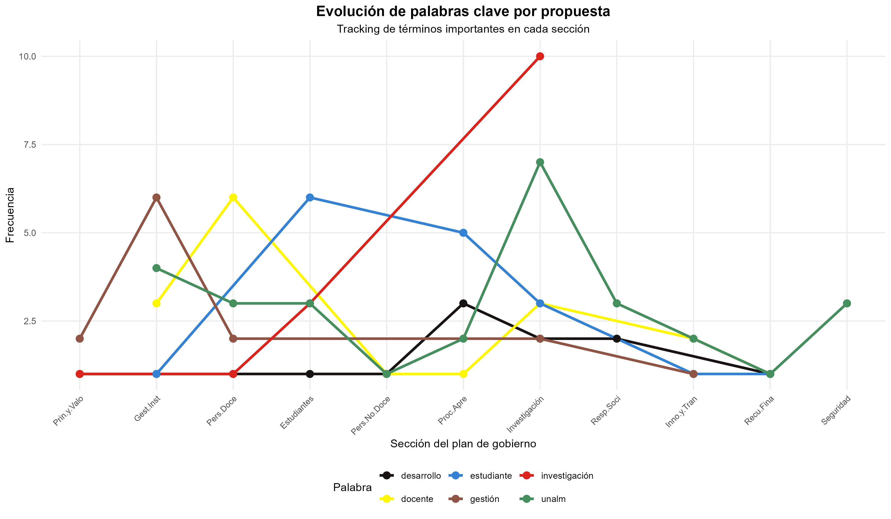
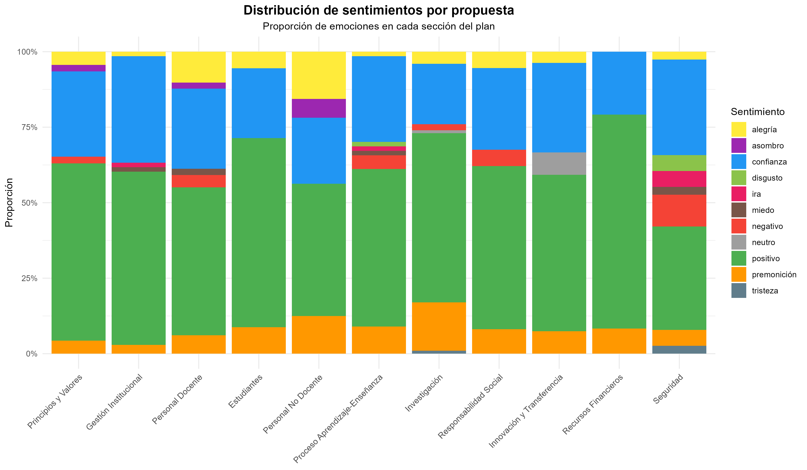
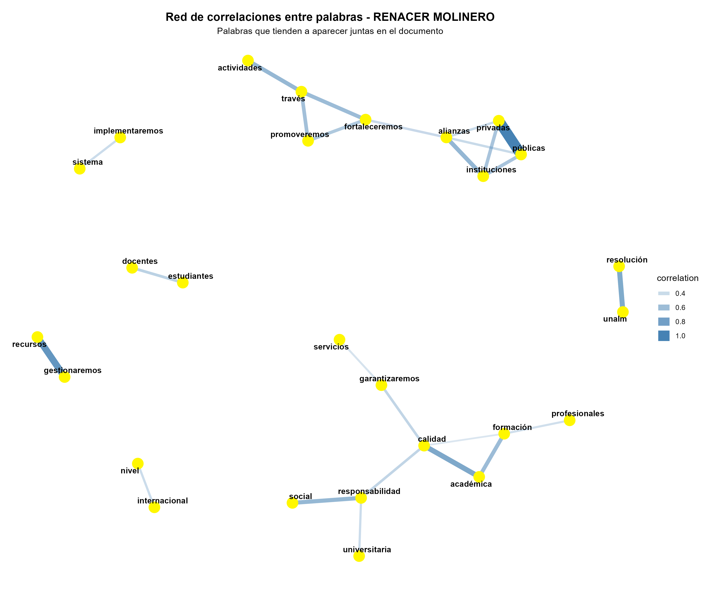

```{r setup, include=FALSE}
knitr::opts_chunk$set(echo = FALSE, message = FALSE, warning = FALSE)
```

## Integrantes

\begin{center}
\begin{tabular}{|l|l|}
\hline
\textbf{Apellidos y Nombres} & \textbf{Correo} \\
\hline
Saavedra Quispe, Aaron Paolo & 20230702@lamolina.edu.pe \\
\hline
Sánchez Cáceres, Danuska Brunela  & 20250423@lamolina.pe \\
\hline
Soto Ortega, Fiorella Belen  & 20250426@lamolina.pe \\
\hline
Uraco Silva, Javier Anthony  & 20230414@lamolina.edu.pe \\
\hline
Velásquez Fuero, Nicoly Dayana & 20220784@lamolina.edu.pe \\
\hline
\end{tabular}
\end{center}

## Introducción

\begin{columns}[c]

\begin{column}{0.5\textwidth}
\begin{center}
```{r out.width="70%"}

```
\end{center}
\end{column}

\begin{column}{0.5\textwidth}
\begin{center}
```{r out.width="100%"}
knitr::include_graphics("tmimagen.jpg")
```
\end{center}
\end{column}

\end{columns}

\vspace{0.3cm}

\begin{center}
\textbf{Metodología:}
\begin{itemize}
\item Corpus dual: general + 11 secciones temáticas
\item Diccionario de sentimientos contextualizado UNALM (80 términos)
\end{itemize}

\vspace{0.3cm}

\textit{Análisis imparcial y objetivo del contenido textual}
\end{center}

## Top 15 Palabras más Frecuentes

\begin{center}
```{r out.width="95%"}

```
\end{center}

## Nube de Palabras

\begin{center}
```{r out.width="85%"}

```
\end{center}

## Distribución de Sentimientos

\begin{columns}[c]

\begin{column}{0.65\textwidth}
```{r out.width="100%"}

```
\end{column}

\begin{column}{0.35\textwidth}
\tiny
\begin{tabular}{|l|r|r|}
\hline
\textbf{Sentimiento} & \textbf{n} & \textbf{\%} \\
\hline
positivo & 316 & 54.6 \\
\hline
confianza & 152 & 26.3 \\
\hline
premonición & 50 & 8.6 \\
\hline
alegría & 27 & 4.7 \\
\hline
negativo & 14 & 2.4 \\
\hline
asombro & 4 & 0.7 \\
\hline
ira & 4 & 0.7 \\
\hline
miedo & 4 & 0.7 \\
\hline
disgusto & 3 & 0.5 \\
\hline
neutro & 3 & 0.5 \\
\hline
tristeza & 2 & 0.3 \\
\hline
\end{tabular}
\end{column}

\end{columns}

## Top 5 Palabras por Sentimiento

\begin{center}
```{r out.width="90%"}

```
\end{center}

## Top 15 Bigramas

\begin{center}
```{r out.width="83%"}

```
\end{center}

## Red de Bigramas

\begin{center}
```{r out.width="80%"}

```
\end{center}

## Palabras Características por Propuesta (TF-IDF)

\begin{center}
```{r out.width="78%"}

```
\end{center}

## Evolución de Palabras Clave

\begin{center}
```{r out.width="100%"}

```
\end{center}

## Distribución de Sentimientos por Propuesta

\begin{center}
```{r out.width="100%"}

```
\end{center}

## Red de Correlaciones entre Palabras

\begin{center}
```{r out.width="80%"}

```
\end{center}

## Observaciones Críticas del Análisis

\vspace{-0.3cm}

\begin{center}
```{r out.width="50%"}

```
\end{center}

\vspace{-0.3cm}

\begin{center}
\textbf{Conceptos con presencia limitada}
\end{center}

\vspace{0.1cm}

\begin{columns}[c]
\begin{column}{0.1\textwidth}
\end{column}

\begin{column}{0.8\textwidth}
\begin{block}{\centering \small Bienestar Estudiantil}
\centering
\scriptsize
\textbf{Ausentes:} Salud mental | Bienestar psicológico | Apoyo emocional
\end{block}
\end{column}

\begin{column}{0.1\textwidth}
\end{column}
\end{columns}

\vspace{0.1cm}

\begin{columns}[c]
\begin{column}{0.1\textwidth}
\end{column}

\begin{column}{0.8\textwidth}
\begin{block}{\centering \small Medio Ambiente}
\centering
\scriptsize
\textbf{Baja frecuencia:} Sostenibilidad ambiental (Inesperado para UNALM)
\end{block}
\end{column}

\begin{column}{0.1\textwidth}
\end{column}
\end{columns}

## Conclusiones

\begin{itemize}
\small

\item \textbf{Palabras clave:} "UNALM", "fortaleceremos", "estudiante" y "docente" dominan el discurso

\vspace{0.2cm}

\item \textbf{Tono emocional:} Más del 70\% de palabras transmiten positividad y confianza

\vspace{0.2cm}

\item \textbf{Bigramas frecuentes:} "responsabilidad social", "formación académica", "alianzas estratégicas" revelan énfasis en identidad molinera y cooperación externa

\vspace{0.2cm}

\item \textbf{Análisis por secciones:} "investigación", "gestión" y "desarrollo" muestran peso en desarrollo científico y administración universitaria

\vspace{0.2cm}

\item \textbf{Correlaciones:} Uniones sólidas entre "alianzas", "fortalecimiento" e "instituciones" confirman orientación hacia cooperación y desarrollo institucional

\end{itemize}